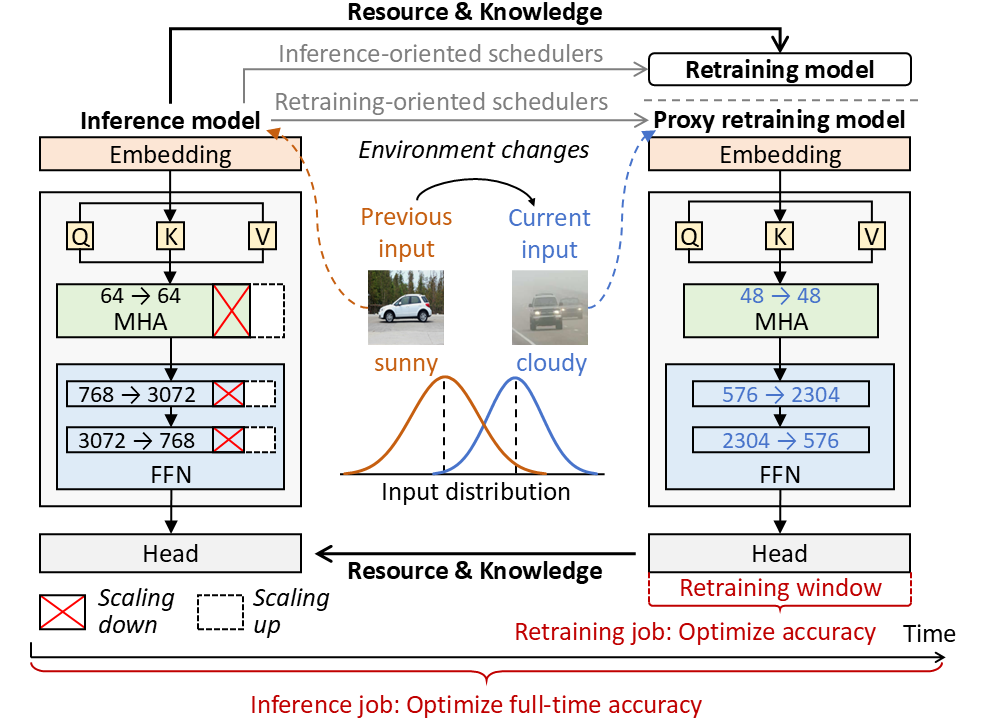
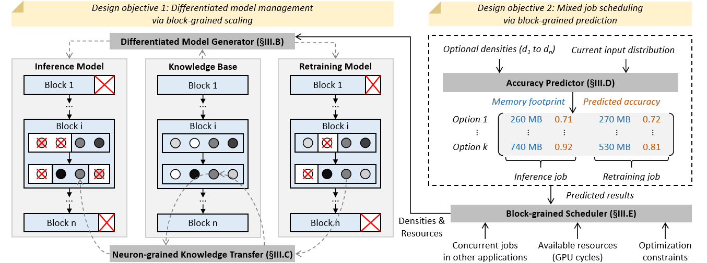
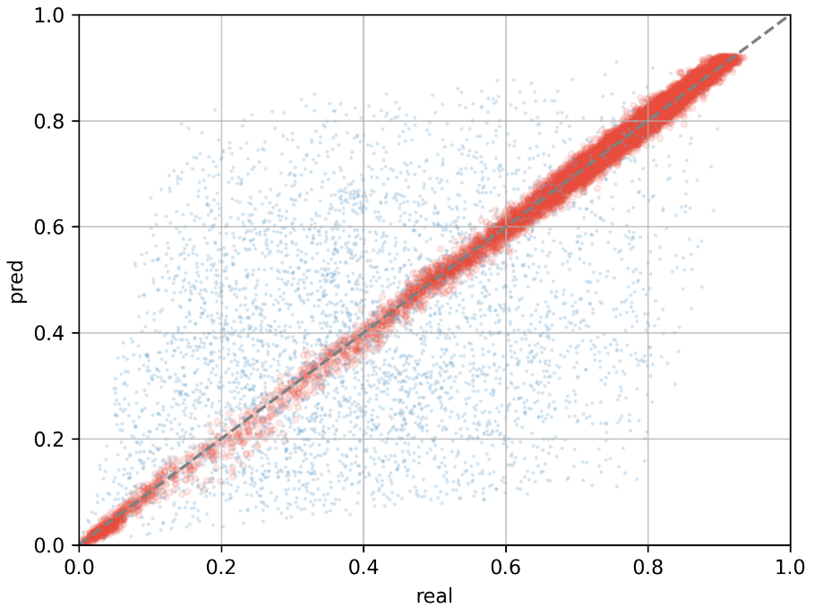
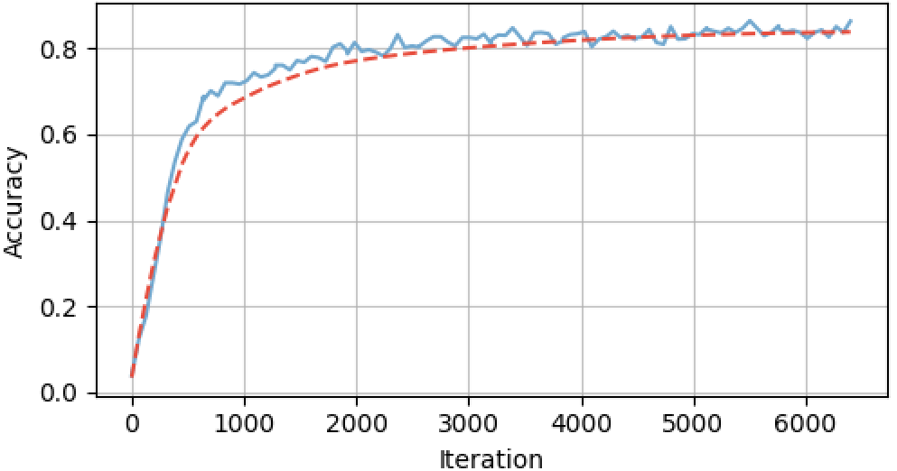
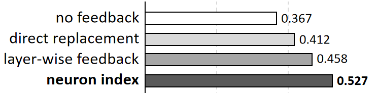
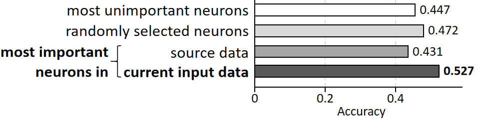
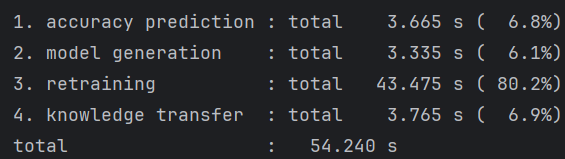
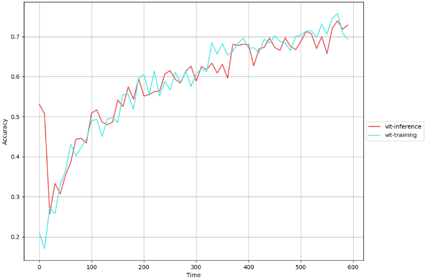
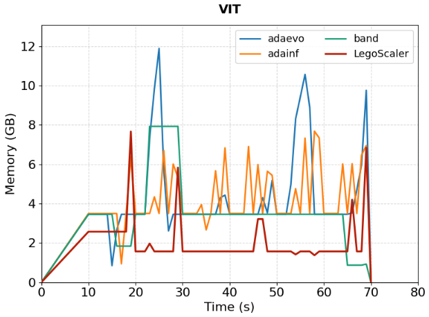
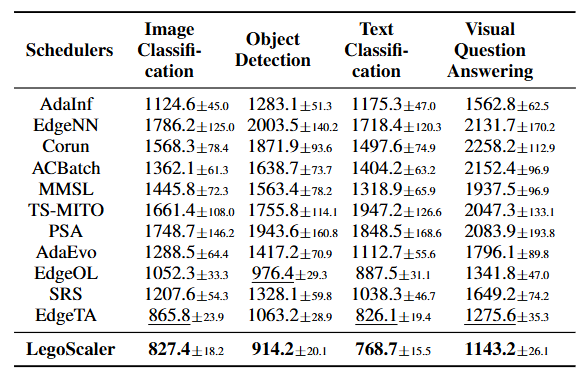

# LegoScaler: Differentiated Block-grained Scaling for Mixed Inference and Retraining Jobs at Edge

<p align="center">
  
</p>

This repository contains the artifacts for the paper **"LegoScaler: Differentiated Block-grained Scaling
for Mixed Inference and Retraining Jobs at Edge"**.

## Outline (Evaluation process/workflow and Reusability)

<a href="#1-artifact-overview">1. Artifact Overview</a><br>
&nbsp;&nbsp;&nbsp;&nbsp;&nbsp;&nbsp;<a href="#11-introduction">1.1 Introduction</a><br>
&nbsp;&nbsp;&nbsp;&nbsp;&nbsp;&nbsp;<a href="#12-hardwaresoftware-requirements-and-dependencies">1.2 Hardware/software Requirements and Dependencies</a><br>
&nbsp;&nbsp;&nbsp;&nbsp;&nbsp;&nbsp;&nbsp;&nbsp;&nbsp;&nbsp;&nbsp;&nbsp;<a href="#121-hardware-requirements">1.2.1 Hardware Requirements</a><br>
&nbsp;&nbsp;&nbsp;&nbsp;&nbsp;&nbsp;&nbsp;&nbsp;&nbsp;&nbsp;&nbsp;&nbsp;<a href="#122-software-requirements">1.2.2 Software Requirements</a><br>
&nbsp;&nbsp;&nbsp;&nbsp;&nbsp;&nbsp;&nbsp;&nbsp;&nbsp;&nbsp;&nbsp;&nbsp;<a href="#123-get-source-code">1.2.3 Get Source Code</a><br>
&nbsp;&nbsp;&nbsp;&nbsp;&nbsp;&nbsp;&nbsp;&nbsp;&nbsp;&nbsp;&nbsp;&nbsp;<a href="#124-install-dependencies">1.2.4 Install Dependencies</a><br>
&nbsp;&nbsp;&nbsp;&nbsp;&nbsp;&nbsp;&nbsp;&nbsp;&nbsp;&nbsp;&nbsp;&nbsp;<a href="#125-about-dataset">1.2.5 About Dataset</a><br>
<a href="#2-evaluation-reproduction">2. Evaluation Reproduction</a><br>
&nbsp;&nbsp;&nbsp;&nbsp;&nbsp;&nbsp;<a href="#21-evaluation-of-accuracy-predictor-figure-7-in-section-v-b">2.1 Evaluation of Accuracy Predictor (Figure 7 in Section V-B)</a><br>
&nbsp;&nbsp;&nbsp;&nbsp;&nbsp;&nbsp;<a href="#22-evaluation-of-knowledge-transfer-figure-8-a-in-section-v-b">2.2 Evaluation of Knowledge Transfer (Figure 8-a in Section V-B)</a><br>
&nbsp;&nbsp;&nbsp;&nbsp;&nbsp;&nbsp;<a href="#23-evaluation-of-model-generator-figure-8-b-in-section-v-b">2.3 Evaluation of Model Generator (Figure 8-b in Section V-B)</a><br>
&nbsp;&nbsp;&nbsp;&nbsp;&nbsp;&nbsp;<a href="#24-execution-time-breakdown-figure-8-c-in-section-v-b">2.4 Execution Time breakdown (Figure 8-c in Section V-B)</a><br>
&nbsp;&nbsp;&nbsp;&nbsp;&nbsp;&nbsp;<a href="#25-evaluation-of-multi-job-scheduling-at-edge-figure-9-in-section-v-c">2.5 Evaluation of Multi-job Scheduling at Edge (Figure 9 in Section V-C)</a><br>
&nbsp;&nbsp;&nbsp;&nbsp;&nbsp;&nbsp;<a href="#26-comparison-of-memory-footprint-figure-10-in-section-v-d">2.6 Comparison of Memory Footprint (Figure 10 in Section V-D)</a><br>
&nbsp;&nbsp;&nbsp;&nbsp;&nbsp;&nbsp;<a href="#27-comparison-of-energy-consumption-table-3-in-section-v-d">2.7 Comparison of Energy Consumption (Table 3 in Section V-D)</a><br>
<a href="#3-reusability-integrating-legoscaler-with-models-and-edge-schedulers">3. Reusability: Integrating LegoScaler with Models and Edge Schedulers</a><br>
&nbsp;&nbsp;&nbsp;&nbsp;&nbsp;&nbsp;<a href="#31-integrating-different-models">3.1 Integrating Different Models</a><br>
&nbsp;&nbsp;&nbsp;&nbsp;&nbsp;&nbsp;<a href="#32-integrating-different-edge-schedulers">3.2 Integrating Different Edge Schedulers</a><br>

## 1. Artifact Overview

### 1.1 Introduction

- **Background**:
  - **Edge AI applications**: Artificial intelligence (AI) applications such as object/image 
  recognition and question answering have become ubiquitous in 
  edge computing system.
  - **Large discrepancy in network architectures**: The inference model is designed for the stationary input distributions, 
  while the retraining model’s network architecture is built upon the current input distribution.
  - **Conflicting optimization objectives in resource allocation**: The objective of an inference model is to 
  maximize its accuracy under the latency constraint over the application’s 
  entire running period. But for the retraining model, it is scaled to maximize the accuracy after a short retraining window (e.g. 30 minutes).

- **LegoScaler Modules**: 
  - **Differentiated model generator**: It retains the most important components of 
  each model according to the current input distribution.
  - **Neuron-grained knowledge transfer**: It propagates the learned knowledge(i.e. the weights' change of neurons) from the 
  retraining model to the inference model through neuron indexes.
  - **Accuracy predictor**: It quantitatively evaluates the model accuracy under different configurations.
  - **Block-grained scheduler**: It selects the optimal scaling solutions and resource allocations that 
  maximize overall accuracy under the optimization constraints.

  

- **Evaluation**: 
  - **Basic setting**: Our experiments compare 11 latest schedulers across 3 multi-application scenarios.
  - **Major results**: LegoScaler improves the overall accuracy average by 29.04%, reduces memory footprint by 37.79%
and energy consumption by 40.2%.

### 1.2 Hardware/software Requirements and Dependencies

#### 1.2.1 Hardware Requirements

- **Hardware requirements for full running of experiments in the paper**:

  <table align="center">
    <thead>
      <tr>
        <th>RAM</th>
        <th>CPU</th>
        <th>Disk</th>
        <th>GPU</th>
      </tr>
    </thead>
    <tbody>
      <tr>
        <td>128 GB</td>
        <td>One 64-core server CPU (e.g., Intel(R) Xeon(R) Gold 6430)</td>
        <td>At least<br>150 GB free</td>
        <td>One NVIDIA GPU with more than 60 GB VRAM (e.g., A100)</td>
      </tr>
    </tbody>
  </table>

#### 1.2.2 Software Requirements

- **Recommended software for full running of experiments in the paper**:

  <table align="center">
    <thead>
      <tr>
        <th>Operating System</th>
        <th>CUDA</th>
        <th>Others</th>
      </tr>
    </thead>
    <tbody>
      <tr>
        <td>Ubuntu LTS 22.04.4 LTS</td>
        <td>CUDA 13.0</td>
        <td>Kernel 6.8.0-124-generic</td>
      </tr>
    </tbody>
  </table>

#### 1.2.3 Get Source Code

  You can obtain the source code for artifacts evaluation by the following command. **The code does not perform any malicious or destructive operations**.

  ```bash
  git clone https://github.com/LINC-BIT/LegoScaler.git
  ```

#### 1.2.4 Install Dependencies

  You can isntall the required dependencies by the following command.

  ```bash
  pip install -r requirements.txt
  ```

#### 1.2.5 About Dataset

- **Dataset for pre-training**:
  After inserting FBS into blocks, the model is pre-trained on the following datasets.

  <table align="center">
    <thead>
      <tr>
        <th>Application</th>
        <th>Dataset</th>
      </tr>
    </thead>
    <tbody>
      <tr>
        <td>Image classification</td>
        <td>ImageNet</td>
      </tr>
    </tbody>
  <tbody>
      <tr>
        <td>Object Detection</td>
        <td>COCO2017</td>
      </tr>
    </tbody>
  <tbody>
      <tr>
        <td>Text classification</td>
        <td>AGNews</td>
      </tr>
    </tbody>
  <tbody>
      <tr>
        <td>Visual question answering</td>
        <td>VQAv2</td>
      </tr>
    </tbody>
  </table>

- **Data points generation**:
  We train a specific accuracy predictor for each model. To train the predictor, we generate thousands of data points using **[EdgeVisionBench](https://github.com/LINC-BIT/EdgeVisionBench)**, which automatically constructs evolving distribution at edge.

- **Dataset for online scheduling**:
  The following datasets are randomly selected for online scheduling experiments.
    <table align="center">
    <thead>
      <tr>
        <th>Application</th>
        <th>Dataset</th>
      </tr>
    </thead>
    <tbody>
      <tr>
        <td>Image classification</td>
        <td>CIFAR-10, STL-10, Caltech-256, Imagenette, Fashion-MNIST</td>
      </tr>
    </tbody>
  <tbody>
      <tr>
        <td>Object Detection</td>
        <td>COCO2017, VOC2012</td>
      </tr>
    </tbody>
  <tbody>
      <tr>
        <td>Text classification</td>
        <td>SST-2, IMDB, AGNews</td>
      </tr>
    </tbody>
  <tbody>
      <tr>
        <td>Visual question answering</td>
        <td>VQAv2-C, VQAv2's last 2129 classes</td>
      </tr>
    </tbody>
  </table>

## 2. Evaluation Reproduction

### 2.1 Evaluation of Accuracy Predictor (Figure 7 in Section V-B)

1. Generate data points for training accuracy predictor:
```bash
cd EdgeScheduler

python schedulers/predictor/scaling_law/cnn/gen_scaling_law_data_points.py
```

2. Train and evaluate the accuracy predictor:
```bash
python schedulers/predictor/scaling_law/scaling_law_trial/two_branch.py
```

The resource requirements and outputs are listed below:

<table align="center">
    <thead>
      <tr>
        <th>Resource Requirements</th>
        <th>Example Running Outputs</th>
      </tr>
    </thead>
    <tbody>
      <tr>
        <td>2 hours<br>10GB memory<br>25GB disk space</td>
        <td>
          
          
        </td>
      </tr>
    </tbody>
</table>

### 2.2 Evaluation of Knowledge Transfer (Figure 8-a in Section V-B)

Commands for 4 knowledge transfer strategies:
```bash
cd EdgeScheduler

# no feedback
python schedulers/examples/two_classification_apps/main.py --knowledge_transfer no

# direct replacement
python schedulers/examples/two_classification_apps/main.py --knowledge_transfer direct

# layer-wise feedback
python schedulers/examples/two_classification_apps/main.py --knowledge_transfer layer

# neuron indexes
python schedulers/examples/two_classification_apps/main.py --knowledge_transfer neuron
```

The resource requirements and outputs are listed below:

<table align="center">
    <thead>
      <tr>
        <th>Resource Requirements</th>
        <th>Example Running Outputs</th>
      </tr>
    </thead>
    <tbody>
      <tr>
        <td>2 hours<br>10GB memory<br>25GB disk space</td>
        <td>
          
        </td>
      </tr>
    </tbody>
</table>

### 2.3 Evaluation of Model Generator (Figure 8-b in Section V-B)

Commands for 4 model generation strategies (how to generate blocks):
```bash
cd EdgeScheduler

# blocks with the most unimportant neurons
python schedulers/examples/two_classification_apps/main.py --model_generate unimportant

# blocks with randomly selected neurons
python schedulers/examples/two_classification_apps/main.py --model_generate random

# blocks with the most important neurons in source data
python schedulers/examples/two_classification_apps/main.py --model_generate source

# blocks with the most important neurons in current input data
python schedulers/examples/two_classification_apps/main.py --model_generate current
```

The resource requirements and outputs are listed below:

<table align="center">
    <thead>
      <tr>
        <th>Resource Requirements</th>
        <th>Example Running Outputs</th>
      </tr>
    </thead>
    <tbody>
      <tr>
        <td>2 hours<br>10GB memory<br>25GB disk space</td>
        <td>
          
        </td>
      </tr>
    </tbody>
</table>

### 2.4 Execution Time breakdown (Figure 8-c in Section V-B)

Commands for testing the execution time:
```bash
cd EdgeScheduler

python schedulers/examples/two_classification_apps/execution_time.py
```

The resource requirements and outputs are listed below:

<table align="center">
    <thead>
      <tr>
        <th>Resource Requirements</th>
        <th>Example Running Outputs</th>
      </tr>
    </thead>
    <tbody>
      <tr>
        <td>2 hours<br>10GB memory<br>25GB disk space</td>
        <td>
          
        </td>
      </tr>
    </tbody>
</table>

### 2.5 Evaluation of Multi-job Scheduling at Edge (Figure 9 in Section V-C)

Commands for running one scenario:
```bash
cd EdgeScheduler

python schedulers/examples/two_classification_apps/main.py
```

The resource requirements and outputs are listed below:

<table align="center">
    <thead>
      <tr>
        <th>Resource Requirements</th>
        <th>Example Running Outputs</th>
      </tr>
    </thead>
    <tbody>
      <tr>
        <td>1 hour<br>20GB memory<br>50GB disk space</td>
        <td>
          
        </td>
      </tr>
    </tbody>
</table>

### 2.6 Comparison of Memory Footprint (Figure 10 in Section V-D)

During the online scheduling experiments, the memory footprint of each scheduler is recorded. 
```bash
cd EdgeScheduler

# run the online scheduling
python schedulers/examples/two_classification_apps/main.py

# draw the memory footprint comparison figure
python schedulers/examples/two_classification_apps/draw_pics/memory_footprint.py
```

The resource requirements and outputs are listed below:

<table align="center">
    <thead>
      <tr>
        <th>Resource Requirements</th>
        <th>Example Running Outputs</th>
      </tr>
    </thead>
    <tbody>
      <tr>
        <td>1 hour<br>20GB memory<br>50GB disk space</td>
        <td>
          
        </td>
      </tr>
    </tbody>
</table>

### 2.7 Comparison of Energy Consumption (Table 3 in Section V-D)

During the online scheduling experiments, the energy consumption of each scheduler is recorded. 
```bash
cd EdgeScheduler

# run the online scheduling
python schedulers/examples/two_classification_apps/main.py

# analysis and statistics of recorded data
python schedulers/examples/two_classification_apps/draw_pics/energy_consumption.py
```

<table align="center">
    <thead>
      <tr>
        <th>Resource Requirements</th>
        <th>Example Running Outputs</th>
      </tr>
    </thead>
    <tbody>
      <tr>
        <td>1 hour<br>20GB memory<br>50GB disk space</td>
        <td>
          
        </td>
      </tr>
    </tbody>
</table>

## 3. Reusability: Integrating LegoScaler with Models and Edge Schedulers

LegoScaler can integrate various **models** (e.g. CNN and Transformer) and
**edge schedulers** (e.g. inference-oriented and retraining-oriented schedulers).

### 3.1 Integrating Different Models

- **Detailed integration steps:**
  - Step 1: Create a function and load the model's pre-trained weights.
    ```bash
    model = XXX.from_pretrained('/path/to/pretrained/weights')
    
    # For example, for ViT-B/16 from HuggingFace:
    model = ViTModel.from_pretrained('google/vit-base-patch16-224-in21k')
    ```

  - Step 2: Add FBS insertion in the class `FBSModelConverter` (already exists).
    ```bash
    class FBSModelConverter:
        def convert_model(self, model):
            if self.model_type == 'XXX':
              for name, module in model.named_children():
                  # Recognize the block according to its name or type
                  if isinstance(module, XXXBlock) or name in ['block1', 'block2', ...]:
                      # Insert FBS into the block
                      fbs_module = FBS(...)
                      setattr(model, name, fbs_module)
    ```
  
  - Step 3: Fine-tune the model on the pre-training dataset through the class `FBSJointTrainer`.
    ```bash
    # load the dataset
    train_loader, test_loader = prepare_XXX_data(batch_size=..., data_dir='/path/to/dataset')
    
    # define the training parameters
    trainer = FBSJointTrainer(num_epochs=..., model_type='XXX', lr=..., train_loader=train_loader, test_loader=test_loader, ...)
    trainer.train()
    ``` 

### 3.2 Integrating Different Edge Schedulers


