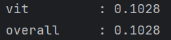
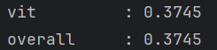
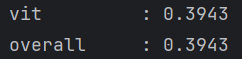
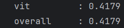
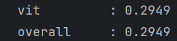
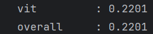
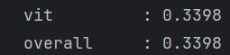

# LegoScaler: Differentiated Block-grained Scaling for Mixed Inference and Retraining Jobs at Edge

<p align="center">
  
</p>

This repository contains the artifacts for the paper **"LegoScaler: Differentiated Block-grained Scaling
for Mixed Inference and Retraining Jobs at Edge"**.

## Outline (Evaluation process/workflow and Reusability)

<a href="#1-artifact-overview">1. Artifact Overview</a><br>
&nbsp;&nbsp;&nbsp;&nbsp;&nbsp;&nbsp;<a href="#11-introduction">1.1 Introduction</a><br>
&nbsp;&nbsp;&nbsp;&nbsp;&nbsp;&nbsp;<a href="#12-hardwaresoftware-requirements-and-dependencies">1.2 Hardware/software Requirements and Dependencies</a><br>
&nbsp;&nbsp;&nbsp;&nbsp;&nbsp;&nbsp;&nbsp;&nbsp;&nbsp;&nbsp;&nbsp;&nbsp;<a href="#121-hardware-requirements">1.2.1 Hardware Requirements</a><br>
&nbsp;&nbsp;&nbsp;&nbsp;&nbsp;&nbsp;&nbsp;&nbsp;&nbsp;&nbsp;&nbsp;&nbsp;<a href="#122-software-requirements">1.2.2 Software Requirements</a><br>
&nbsp;&nbsp;&nbsp;&nbsp;&nbsp;&nbsp;&nbsp;&nbsp;&nbsp;&nbsp;&nbsp;&nbsp;<a href="#123-get-source-code">1.2.3 Get Source Code</a><br>
&nbsp;&nbsp;&nbsp;&nbsp;&nbsp;&nbsp;&nbsp;&nbsp;&nbsp;&nbsp;&nbsp;&nbsp;<a href="#124-install-dependencies">1.2.4 Install Dependencies</a><br>
&nbsp;&nbsp;&nbsp;&nbsp;&nbsp;&nbsp;&nbsp;&nbsp;&nbsp;&nbsp;&nbsp;&nbsp;<a href="#125-about-dataset">1.2.5 About Dataset</a><br>
<a href="#2-evaluation-reproduction">2. Evaluation Reproduction</a><br>
&nbsp;&nbsp;&nbsp;&nbsp;&nbsp;&nbsp;<a href="#21-evaluation-of-accuracy-predictor-figure-7-in-section-v-b">2.1 Evaluation of Accuracy Predictor (Figure 7 in Section V-B)</a><br>
&nbsp;&nbsp;&nbsp;&nbsp;&nbsp;&nbsp;<a href="#22-evaluation-of-knowledge-transfer-figure-8-a-in-section-v-b">2.2 Evaluation of Knowledge Transfer (Figure 8-a in Section V-B)</a><br>
&nbsp;&nbsp;&nbsp;&nbsp;&nbsp;&nbsp;<a href="#23-evaluation-of-model-generator-figure-8-b-in-section-v-b">2.3 Evaluation of Model Generator (Figure 8-b in Section V-B)</a><br>
&nbsp;&nbsp;&nbsp;&nbsp;&nbsp;&nbsp;<a href="#24-execution-time-breakdown-figure-8-c-in-section-v-b">2.4 Execution Time breakdown (Figure 8-c in Section V-B)</a><br>
&nbsp;&nbsp;&nbsp;&nbsp;&nbsp;&nbsp;<a href="#25-evaluation-of-multi-job-scheduling-at-edge-figure-9-in-section-v-c">2.5 Evaluation of Multi-job Scheduling at Edge (Figure 9 in Section V-C)</a><br>
&nbsp;&nbsp;&nbsp;&nbsp;&nbsp;&nbsp;<a href="#26-comparison-of-memory-footprint-figure-10-in-section-v-d">2.6 Comparison of Memory Footprint (Figure 10 in Section V-D)</a><br>
&nbsp;&nbsp;&nbsp;&nbsp;&nbsp;&nbsp;<a href="#27-comparison-of-energy-consumption-table-3-in-section-v-d">2.7 Comparison of Energy Consumption (Table 3 in Section V-D)</a><br>
<a href="#3-reusability-integrating-legoscaler-with-models-and-edge-schedulers">3. Reusability: Integrating LegoScaler with Models and Edge Schedulers</a><br>
&nbsp;&nbsp;&nbsp;&nbsp;&nbsp;&nbsp;<a href="#31-supported-models">3.1 Supported Models</a><br>
&nbsp;&nbsp;&nbsp;&nbsp;&nbsp;&nbsp;<a href="#32-integrating-different-models">3.2 Integrating Different Models</a><br>
&nbsp;&nbsp;&nbsp;&nbsp;&nbsp;&nbsp;<a href="#33-integrating-different-edge-schedulers">3.3 Integrating Different Edge Schedulers</a><br>
&nbsp;&nbsp;&nbsp;&nbsp;&nbsp;&nbsp;&nbsp;&nbsp;&nbsp;&nbsp;&nbsp;&nbsp;<a href="#331-integrating-inference-oriented-schedulers">3.3.1 Integrating Inference-oriented Schedulers</a><br>
&nbsp;&nbsp;&nbsp;&nbsp;&nbsp;&nbsp;&nbsp;&nbsp;&nbsp;&nbsp;&nbsp;&nbsp;<a href="#332-integrating-retraining-oriented-schedulers">3.3.2 Integrating Retraining-oriented Schedulers</a><br>
&nbsp;&nbsp;&nbsp;&nbsp;&nbsp;&nbsp;&nbsp;&nbsp;&nbsp;&nbsp;&nbsp;&nbsp;<a href="#333-integrating-other-edge-schedulers">3.3.3 Integrating Other Schedulers</a><br>


## 1. Artifact Overview

### 1.1 Introduction

- **Background**:
  - **Edge AI applications**: Artificial intelligence (AI) applications such as object/image 
  recognition and question answering have become ubiquitous in 
  edge computing system.
  - **Large discrepancy in network architectures**: The inference model is designed for the stationary input distributions, 
  while the retraining model’s network architecture is built upon the current input distribution.
  - **Conflicting optimization objectives in resource allocation**: The objective of an inference model is to 
  maximize its accuracy under the latency constraint over the application’s 
  entire running period. But for the retraining model, it is scaled to maximize the accuracy after a short retraining window (e.g. 30 minutes).

- **LegoScaler Modules**: 
  - **Differentiated model generator**: It retains the most important components of 
  each model according to the current input distribution.
  - **Neuron-grained knowledge transfer**: It propagates the learned knowledge(i.e. the weights' change of neurons) from the 
  retraining model to the inference model through neuron indexes.
  - **Accuracy predictor**: It quantitatively evaluates the model accuracy under different configurations.
  - **Block-grained scheduler**: It selects the optimal scaling solutions and resource allocations that 
  maximize overall accuracy under the optimization constraints.

  

- **Evaluation**: 
  - **Basic setting**: Our experiments compare 11 latest schedulers across 3 multi-application scenarios.
  - **Major results**: LegoScaler improves the overall accuracy average by 29.04%, reduces memory footprint by 37.79%
and energy consumption by 40.2%.

### 1.2 Hardware/software Requirements and Dependencies

#### 1.2.1 Hardware Requirements

- **Hardware requirements for full running of experiments in the paper**:

  <table align="center">
    <thead>
      <tr>
        <th>RAM</th>
        <th>CPU</th>
        <th>Disk</th>
        <th>GPU</th>
      </tr>
    </thead>
    <tbody>
      <tr>
        <td>128 GB</td>
        <td>One 64-core server CPU (e.g., Intel(R) Xeon(R) Gold 6430)</td>
        <td>At least<br>150 GB free</td>
        <td>One NVIDIA GPU with more than 60 GB VRAM (e.g., A100)</td>
      </tr>
    </tbody>
  </table>

#### 1.2.2 Software Requirements

- **Recommended software for full running of experiments in the paper**:

  <table align="center">
    <thead>
      <tr>
        <th>Operating System</th>
        <th>CUDA</th>
        <th>Others</th>
      </tr>
    </thead>
    <tbody>
      <tr>
        <td>Ubuntu LTS 22.04.4 LTS</td>
        <td>CUDA 13.0</td>
        <td>Kernel 6.8.0-124-generic</td>
      </tr>
    </tbody>
  </table>

#### 1.2.3 Get Source Code

  You can obtain the source code for artifacts evaluation by the following command. **The code does not perform any malicious or destructive operations**.

  ```bash
  git clone https://github.com/LINC-BIT/LegoScaler.git
  ```

#### 1.2.4 Install Dependencies

  You can isntall the required dependencies by the following command.

  ```bash
  pip install -r requirements.txt
  ```

#### 1.2.5 About Dataset

- **Dataset for pre-training**:
  After inserting FBS into blocks, the model is pre-trained on the following datasets.

  <table align="center">
    <thead>
      <tr>
        <th>Application</th>
        <th>Dataset</th>
      </tr>
    </thead>
    <tbody>
      <tr>
        <td>Image classification</td>
        <td>ImageNet</td>
      </tr>
    </tbody>
  <tbody>
      <tr>
        <td>Object Detection</td>
        <td>VOC2012</td>
      </tr>
    </tbody>
  <tbody>
      <tr>
        <td>Semantic segmentation</td>
        <td>VOC2012</td>
      </tr>
    </tbody>
  <tbody>
      <tr>
        <td>Text classification</td>
        <td>AGNews</td>
      </tr>
    </tbody>
  <tbody>
      <tr>
        <td>Visual question answering</td>
        <td>VQAv2</td>
      </tr>
    </tbody>
  </table>

- **Data points generation**:
  We train a specific accuracy predictor for each model. To train the predictor, we generate thousands of data points using **[EdgeVisionBench](https://github.com/LINC-BIT/EdgeVisionBench)**, which automatically constructs evolving distribution at edge.

- **Dataset for online scheduling**:
  The following datasets are randomly selected for online scheduling experiments.
    <table align="center">
    <thead>
      <tr>
        <th>Application</th>
        <th>Dataset</th>
      </tr>
    </thead>
    <tbody>
      <tr>
        <td>Image classification</td>
        <td>CIFAR-10, STL-10, Caltech-256, Imagenette, Fashion-MNIST</td>
      </tr>
    </tbody>
  <tbody>
      <tr>
        <td>Object Detection</td>
        <td>COCO2014, VOC2012</td>
      </tr>
    </tbody>
  <tbody>
      <tr>
        <td>Semantic segmentation</td>
        <td>VOC2012</td>
      </tr>
    </tbody>
  <tbody>
      <tr>
        <td>Text classification</td>
        <td>SST-2, IMDB, AGNews</td>
      </tr>
    </tbody>
  <tbody>
      <tr>
        <td>Visual question answering</td>
        <td>VQAv2-C, VQAv2's last 2129 classes</td>
      </tr>
    </tbody>
  </table>

## 2. Evaluation Reproduction

### 2.1 Evaluation of Accuracy Predictor (Figure 7 in Section V-B)

1. Generate data points for training accuracy predictor:
```bash
cd EdgeScheduler

python schedulers/predictor/scaling_law/cnn/gen_scaling_law_data_points.py
```

2. Train and evaluate the accuracy predictor:
```bash
python schedulers/predictor/scaling_law/scaling_law_trial/two_branch.py
```

The resource requirements and outputs are listed below:

<table align="center">
    <thead>
      <tr>
        <th>Resource Requirements</th>
        <th>Settings</th>
        <th>Example Running Outputs</th>
      </tr>
    </thead>
    <tbody>
      <tr>
        <td>2 hours<br>10GB memory<br>25GB disk space</td>
        <td>Model: ResNet-18</td>
        <td>
          
          
        </td>
      </tr>
    </tbody>
</table>

### 2.2 Evaluation of Knowledge Transfer (Figure 8-a in Section V-B)

This experiment evaluates how the knowledge learned by a retrained model flows back to the inference model through knowledge base.

  - **No feedback (`no`)**: The retraining model is discarded after its retraining window, and nothing is written back to the knowledge base.
  - **Direct replacement (`direct`)**: The retraining model directly replaces the inference model.
  - **Layer-wise feedback (`layer`)**: For each layer, the neuron weight changes produced by retraining are averaged into a single value, and this value is added back to every neuron of the corresponding layer in the knowledge base.
  - **Neuron-index feedback (`neuron`)**: Only the neurons actually trained in the retraining window are softly written back to their exact positions in the knowledge base through neuron indexes.

Commands for the 4 knowledge transfer strategies:
```bash
cd EdgeScheduler

# no feedback
python examples/experiments/main.py --knowledge_transfer no

# direct replacement
python examples/experiments/main.py --knowledge_transfer direct

# layer-wise feedback
python examples/experiments/main.py --knowledge_transfer layer

# neuron indexes
python examples/experiments/main.py --knowledge_transfer neuron
```

The resource requirements and outputs are listed below:

<table align="center">
    <thead>
      <tr>
        <th>Resource Requirements</th>
        <th>Settings</th>
        <th>Example Running Outputs</th>
      </tr>
    </thead>
    <tbody>
      <tr>
        <td>10GB memory<br>25GB disk space</td>
        <td>Model: ViT-B/16</td>
        <td> 
          1. No feedback:
          <br>
          2. Direct replacement:
          <br>
          3. Layer-wise feedback:
          <br>
          4. Neuron-index feedback:
          <br>
        </td>
      </tr>
    </tbody>
</table>

### 2.3 Evaluation of Model Generator (Figure 8-b in Section V-B)

This experiment evaluates how a scaled sub-model (its retained blocks/neurons) is generated when the block-grained scaling is performed: at a given density, which neurons are kept. The FBS modules predict the importance of each channel from the input they receive.

  - **Unimportant neurons (`unimportant`)**: Keep the least important neurons, i.e. the inverse of the importance-based selection (baseline).
  - **Random selection (`random`)**: Keep randomly chosen neurons (baseline).
  - **Importance on the source data (`source`)**: Measure the neuron importance by forwarding samples of the source (initial) dataset through the FBS modules, then keep the most important neurons.
  - **Importance on the current data (`current`)**: Measure the neuron importance on the samples of the current input distribution, then keep the most important neurons.

Commands for the 4 model generation strategies:
```bash
cd EdgeScheduler

# blocks with the least important neurons
python examples/experiments/main.py --model_generate unimportant

# blocks with randomly selected neurons
python examples/experiments/main.py --model_generate random

# blocks with the most important neurons measured on the source data
python examples/experiments/main.py --model_generate source

# blocks with the most important neurons measured on the current data
python examples/experiments/main.py --model_generate current
```

The resource requirements and outputs are listed below:

<table align="center">
    <thead>
      <tr>
        <th>Resource Requirements</th>
        <th>Settings</th>
        <th>Example Running Outputs</th>
      </tr>
    </thead>
    <tbody>
      <tr>
        <td>10GB memory<br>25GB disk space</td>
        <td>Model: ViT-B/16</td>
        <td>
          1. Most unimportant:
          <br>
          2. Random selection:
          <br>
          3. Most important on the source data:
          <br>
          4. Most important on the current data:
          <br>
        </td>
      </tr>
    </tbody>
</table>

### 2.4 Execution Time breakdown (Figure 8-c in Section V-B)

This experiment breaks the wall time of one scheduling round of the whole pipeline down into its four steps:

  1. **Accuracy prediction**: evaluating candidate model-size configurations with the accuracy predictor inside the scheduler;
  2. **Model generation**: building the scaled sub-model from the channel importance predicted by the FBS modules;
  3. **Retraining**: the retraining loop of the retraining job;
  4. **Knowledge transfer**: writing the retrained knowledge back to the inference model.

Commands for testing the execution time:
```bash
cd EdgeScheduler

python examples/experiments/execution_time.py
```

The resource requirements and outputs are listed below:

<table align="center">
    <thead>
      <tr>
        <th>Resource Requirements</th>
        <th>Settings</th>
        <th>Example Running Outputs</th>
      </tr>
    </thead>
    <tbody>
      <tr>
        <td>10GB memory<br>25GB disk space</td>
        <td>Model: ResNet-18</td>
        <td>
          
        </td>
      </tr>
    </tbody>
</table>

### 2.5 Evaluation of Multi-job Scheduling at Edge (Figure 9 in Section V-C)

This experiment evaluates LegoScaler and the other schedulers on **multi-job edge workloads**, where several applications run their inference and retraining jobs concurrently under an evolving input distribution. The scheduler under test is selected with the `--scheduler` argument (default `ours`, i.e. LegoScaler).

Run one scenario under one scheduler:
```bash
cd EdgeScheduler

# run one scenario with LegoScaler (adjust the scenario by editing apps/apps_events in main.py)
python examples/experiments/main.py

# run the same scenario under another scheduler, e.g.:
python examples/experiments/main.py --scheduler EdgeOL
```

The resource requirements and outputs are listed below:

<table align="center">
    <thead>
      <tr>
        <th>Resource Requirements</th>
        <th>Settings</th>
        <th>Example Running Outputs</th>
      </tr>
    </thead>
    <tbody>
      <tr>
        <td>20GB memory<br>50GB disk space</td>
        <td>Model: ResNet-18<br>Execution time: 10 minutes</td>
        <td>
          
        </td>
      </tr>
    </tbody>
</table>

### 2.6 Comparison of Memory Footprint (Figure 10 in Section V-D)

During the online scheduling experiments, each running job reports the memory of the model it actually uses at every scheduling window into `memory_logs.jsonl`, tagged with the scheduler name and run id. LegoScaler thus shows the scaled sub-model with short generation/feedback peaks, while the baselines hold the full model during retraining.

```bash
cd EdgeScheduler

# run the online scheduling for each scheduler
python examples/experiments/main.py

# aggregate the recorded logs into the per-model jsonl files
python examples/experiments/draw_pics/memory_from_logs.py

# draw the memory footprint comparison figure
python examples/experiments/draw_pics/memory_footprint.py
```

The resource requirements and outputs are listed below:

<table align="center">
    <thead>
      <tr>
        <th>Resource Requirements</th>
        <th>Settings</th>
        <th>Example Running Outputs</th>
      </tr>
    </thead>
    <tbody>
      <tr>
        <td>1 hour<br>20GB memory<br>50GB disk space</td>
        <td>Model: ResNet-18</td>
        <td>
          
        </td>
      </tr>
    </tbody>
</table>

### 2.7 Comparison of Energy Consumption (Table 3 in Section V-D)

This experiment measures the real GPU energy consumption of a scheduling run with **NVML**. The scenario runs one application for a single short round while the driver samples the power draw of every GPU (default interval 0.1 s) and integrates it over the scheduling execution (the model-loading preparation is not counted); a short idle window is measured beforehand, so both the total and the net (above-idle) energy are reported.

```bash
cd EdgeScheduler

# measure the energy consumption of one short scheduling run (LegoScaler by default)
python examples/experiments/energy_consumption.py

# run the same scenario under another scheduler, e.g.:
python examples/experiments/energy_consumption.py --scheduler uniform
```

<table align="center">
    <thead>
      <tr>
        <th>Resource Requirements</th>
        <th>Example Running Outputs</th>
      </tr>
    </thead>
    <tbody>
      <tr>
        <td>1 hour<br>20GB memory<br>50GB disk space</td>
        <td>
          
        </td>
      </tr>
    </tbody>
</table>

## 3. Reusability: Integrating LegoScaler with Models and Edge Schedulers

LegoScaler can integrate various **models** (e.g. CNN and Transformer) and
**edge schedulers** (e.g. inference-oriented and retraining-oriented schedulers).

### 3.1 Supported Models

**Image classification**

  ||Model Name|Source Data|Script|
  |--|--|--|--|
  |&#9745;|[ResNet (CVPR'2016)](https://openaccess.thecvf.com/content_cvpr_2016/html/He_Deep_Residual_Learning_CVPR_2016_paper.html) |[ImageNet](https://www.image-net.org/)|[Demo](EdgeScheduler/examples/experiments/image_classification/resnet18.py)|
  |&#9745;|[MobileNetV2 (CVPR'2018)](https://arxiv.org/abs/1801.04381)|[ImageNet](https://www.image-net.org/)| [Demo](EdgeScheduler/examples/experiments/image_classification/mobilenetv2.py)|
  |&#9745;|[VGG (ICLR'2015)](http://arxiv.org/abs/1409.1556)|[ImageNet](https://www.image-net.org/)| [Demo](EdgeScheduler/examples/experiments/image_classification/vgg16.py)|
  |&#9745;|[ConvNext (CVPR'2022)](https://arxiv.org/abs/2201.03545)|[ImageNet](https://www.image-net.org/)| [Demo](EdgeScheduler/examples/experiments/image_classification/convnext.py)|
  |&#9745;|[InternImage (CVPR'2023)](https://arxiv.org/abs/2211.05778)|[ImageNet](https://www.image-net.org/)| [Demo](EdgeScheduler/examples/experiments/image_classification/internimage.py)|
  |&#9745;|[ViT (ICLR'2021)](https://arxiv.org/abs/2010.11929) |[ImageNet](https://www.image-net.org/)|[Demo](EdgeScheduler/examples/experiments/image_classification/vit.py)|
  |&#9745;|[DINOv2 (TMLR'2024)](https://arxiv.org/abs/2304.07193)|[ImageNet](https://www.image-net.org/)|[Demo](EdgeScheduler/examples/experiments/image_classification/dinov2.py)|
  |&#9745;|[CLIP (ICML'2021)](https://arxiv.org/abs/2103.00020)|[ImageNet](https://www.image-net.org/)|[Demo](EdgeScheduler/examples/experiments/image_classification/clip.py)|

**Object detection**

  ||Model Name|Source Data|Script|
  |--|--|--|--|
  |&#9745;|[Fast R-CNN (NIPS'2015)](https://ieeexplore.ieee.org/abstract/document/7485869)| [PARSCAL VOC 2012](http://host.robots.ox.ac.uk/pascal/VOC)|[Demo](EdgeScheduler/examples/experiments/object_detection/faster_rcnn.py)|
  |&#9745;|[YOLOS (NeurIPS'2021)](https://arxiv.org/abs/2106.00666)| [PARSCAL VOC 2012](http://host.robots.ox.ac.uk/pascal/VOC)|[Demo](EdgeScheduler/examples/experiments/object_detection/yolos.py)|


**Semantic segmentation**

  ||Model Name|Source Data|Script|
  |--|--|--|--|
  |&#9745;|[FCN (CVPR'2015)](https://openaccess.thecvf.com/content_cvpr_2015/html/Long_Fully_Convolutional_Networks_2015_CVPR_paper.html)| [PARSCAL VOC 2012](http://host.robots.ox.ac.uk/pascal/VOC) |[Demo](EdgeScheduler/examples/experiments/semantic_segmentation/fcn.py)|
  |&#9745;|[DeepLab v3 (ArXiv'2017)](https://arxiv.org/abs/1706.05587)| [PARSCAL VOC 2012](http://host.robots.ox.ac.uk/pascal/VOC) |[Demo](EdgeScheduler/examples/experiments/semantic_segmentation/deeplabv3.py)|


**Action recognition**
  
  ||Model Name|Source Data|Script|
  |--|--|--|--|
  |&#9745;|[TSN (ECCV'2016)](https://link.springer.com/chapter/10.1007/978-3-319-46484-8_2)|[HMDB51](https://serre.lab.brown.edu/hmdb51.html)|[Demo](EdgeScheduler/examples/experiments/action_recognition/tsn.py)|
  |&#9745;|[TRN (ECCV'2018)](https://openaccess.thecvf.com/content_ECCV_2018/html/Bolei_Zhou_Temporal_Relational_Reasoning_ECCV_2018_paper.html)|[HMDB51](https://serre.lab.brown.edu/hmdb51.html)|[Demo](EdgeScheduler/examples/experiments/action_recognition/trn.py)|


**Text classification**

  ||Model Name|Source Data|Script|
  |--|--|--|--|
  |&#9745;|[LSTM](https://deeplearning.cs.cmu.edu/S23/document/readings/LSTM.pdf)|[IMDB](https://huggingface.co/datasets/stanfordnlp/imdb)| [Demo](EdgeScheduler/examples/experiments/text_classification/lstm.py) |
  |&#9745;|[RNN](https://arxiv.org/abs/1409.2329)|[IMDB](https://huggingface.co/datasets/stanfordnlp/imdb)| [Demo](EdgeScheduler/examples/experiments/text_classification/rnn.py) |
  |&#9745;|[BERT (NAACL'2019)](https://arxiv.org/abs/1810.04805)|[IMDB](https://huggingface.co/datasets/stanfordnlp/imdb)| [Demo](EdgeScheduler/examples/experiments/text_classification/bert.py) |
  |&#9745;|[RoBERTa (arXiv'2019)](https://arxiv.org/abs/1907.11692)|[IMDB](https://huggingface.co/datasets/stanfordnlp/imdb)| [Demo](EdgeScheduler/examples/experiments/text_classification/roberta.py) |
  |&#9745;|[GPT-2 (OpenAI'2019)](https://cdn.openai.com/better-language-models/language_models_are_unsupervised_multitask_learners.pdf)|[IMDB](https://huggingface.co/datasets/stanfordnlp/imdb)| [Demo](EdgeScheduler/examples/experiments/text_classification/gpt2.py) |
  |&#9745;|[SmolLM2-135M (arXiv'2025)](https://arxiv.org/abs/2502.02737)|[IMDB](https://huggingface.co/datasets/stanfordnlp/imdb)| [Demo](EdgeScheduler/examples/experiments/text_classification/smollm2.py) |
  |&#9745;|[Qwen2.5-0.5B (arXiv'2024)](https://arxiv.org/abs/2412.15115)|[IMDB](https://huggingface.co/datasets/stanfordnlp/imdb)| [Demo](EdgeScheduler/examples/experiments/text_classification/qwen25.py) |


**Visual question answering**

  ||Model Name|Source Data|Script|
  |--|--|--|--|
  |&#9745;|[ViLT (ICML'2021)](https://arxiv.org/abs/2102.03334)|[VQAv2](https://visualqa.org/)|[Demo](EdgeScheduler/examples/experiments/visual_question_answering/vilt.py)|


### 3.2 Integrating Different Models

- **Offline integration: from a pre-trained model to a schedulable FBS model.** The FBS module keeps the weights of an original layer and adds a channel-importance predictor — that is what enables block-grained scaling at runtime. The pipeline has six steps, each producing the artifact the next one consumes; every script already exists in this repo, so for a new architecture just copy the closest one.

    ```text
    pre-trained model
          │
     Step 1  insert FBS            create_fbs_<model>() or FBSModelConverter  →  FBS model (density=1.0)
     Step 2  joint fine-tuning     FBSJointTrainer + train/<model>_fbs.py     →  best_fbs_<model>_model.pth
     Step 3  data points           1_gen.py (random trials → retrain → eval)  →  scaling_law_data_points.pth
     Step 4  accuracy predictor    two_branch.py (fit EdgeScalingLaw)         →  best_edge_scaling_law_fcn.pt
     Step 5  latency               measure_latency.py                         →  latency_results.json
     Step 6  path registration     app_impl.py + schedulers/retraining/ours.py
          │
          ▼
    online scheduling (next part of this section)
    ```

  - **Step 1: Insert FBS into the pre-trained model** — `FBS_nets/nets/create_fbs_model.py`.

    Use the ready-made `create_fbs_<model>()` helper (it loads the pre-trained weights, applies model-specific pre-processing and runs the converter), or call `FBSModelConverter` directly. Pass the architecture name via `model_type` (the converter dispatches per architecture, e.g. `vit`).

    ```python
    from EdgeScheduler.examples.experiments.FBS_nets.nets.create_fbs_model import FBSModelConverter

    model = XXX.from_pretrained('/path/to/pretrained/weights')  # e.g. ViTModel.from_pretrained('google/vit-base-patch16-224-in21k')

    converter = FBSModelConverter(density=1.0, model_type='XXX')  # 'XXX' = your architecture branch
    fbs_model = converter.convert_model(model)
    ```

    **What one FBS module does, in four moves:**
    1. **Keep** — the original layer stays untouched (`original_layer`); FBS only wraps it.
    2. **Score** — a small predictor `Linear(in, 2*in) → ReLU → Linear(2*in, out)` reads the layer input, subsampled to one scalar per channel by the mean of `|x|` (default `subsample_method='l1_norm'`; `'avg_pool'` is the alternative), and outputs a saliency score per output channel.
    3. **Mask** — `density` sets how many channels survive: `k = max(1, int(density * out_channels))`; the forward pass multiplies the layer output with a per-sample k-winners-take-all mask built from the scores. The mask is kept as `dynamic_mask` — the sub-model extractor reads it at scheduling time.
    4. **Learn (optional)** — `detr` / `yolos` apply the mask through a straight-through estimator (`STE_MODEL_TYPES`), so the task-loss gradient flows back into the predictor; other architectures can opt in with `ste=True` (for ablation).

    **Where FBS goes, per architecture** (see the `create_fbs_*` helpers for the exact wrapped layers):
    - `vit` — the attention Q/K/V projections and the FFN `intermediate.dense`; the QKV linears are first SVD-decomposed (`svd_decompose_linear`) so attention can be scaled too; the 12 encoder layers count as **6 blocks** (one density per 2 layers). `yolos` reuses the same ViT-backbone rule and leaves its detection heads untouched.
    - classification CNNs (`resnet18` / `vgg16` / `mobilenetv2` / `convnext` / `internimage`) wrap convolution (or ConvNeXt-style linear) blocks; text models (`lstm` / `rnn` / `gpt2` / `bert` / `roberta` / `smollm2` / `qwen25`) wrap projection / FFN linears; `faster_rcnn` / `detr` / `fcn` / `deeplabv3` have their own branches.

    Tip: create the model with `density=1.0` — the per-block densities are only drawn later (Step 3 / scheduling), not now.

    **Supporting a new architecture:** add a branch in `FBSModelConverter.convert_model` that wraps the layers to be scaled with `FBS(original_layer=..., in_channels=..., out_channels=..., density=..., model_type='XXX')`, plus a matching entry in `FBS.forward`'s mask-shape dispatch.

  - **Step 2: Jointly fine-tune the FBS model** — `FBSJointTrainer` in `FBS_nets/utils.py`; reference scripts `FBS_nets/train/<model>_fbs.py`. The trainer trains the whole network and the FBS predictors together. Dataloader functions follow the signature `get_XXX_dataloader(split, batch_size, model_type=None) -> (loader, dataset)`.

    ```python
    from EdgeScheduler.examples.experiments.FBS_nets.utils import FBSJointTrainer
    from EdgeScheduler.examples.experiments.data import get_XXX_dataloader

    train_loader, _ = get_XXX_dataloader('train', batch_size=64, model_type='XXX')
    val_loader, _   = get_XXX_dataloader('val',   batch_size=64, model_type='XXX')

    trainer = FBSJointTrainer(model=fbs_model, train_loader=train_loader, val_loader=val_loader,
                              device='cuda', num_classes=..., model_type='XXX', num_epochs=20)
    trainer.train(epochs=20, save_dir='/path/to/fbs_checkpoints', task_type='cls')
    ```

    **How it is configured:**
    - **Two parameter groups, one base lr.** The main network and the FBS predictors (`'predictor' in name`) form two Adam groups (weight decay `1e-4`) at the same base lr; override with `lr=`. The base lr depends on `model_type`:

      | model_type | base lr |
      |--|--|
      | `cnn` / `fcn` / `deeplabv3` | `1e-3` |
      | `convnext` / `internimage` / `vgg16` | `3e-4` |
      | `vit` / `clip` / `dinov2` / `detr` / `yolos` / `lstm` / `rnn` | `1e-4` |
      | `vilt` / `smollm2` / `qwen25` | `5e-5` |
      | `gpt2` / `bert` / `roberta` | `1e-5` |
      | `faster_rcnn` | `0.01` |

    - **Special recipes for detection / segmentation.**
      - `detr` / `yolos`: AdamW with the backbone at lr/10 — a uniform large lr destroys the pre-trained features (DETR degenerates to predicting "no object"); `detr` additionally gives the FBS predictors 5x lr.
      - `faster_rcnn` (SGD, momentum 0.9) and `fcn` / `deeplabv3` (SGD, momentum 0.9, wd `5e-4`): the randomly-initialized FBS predictors get 10x lr.
    - **Objective.** `task loss + lambda_reg × L1 penalty on the saliency scores`, averaged over all FBS modules with `lambda_reg = 3e-3` — the second term is a **regularizer, not a loss** (the logs report it separately as `正则项`, and the training-history figure does not draw its curve); it shapes the scores so that density scaling is meaningful.
    - **Task loop.** `train(epochs, save_dir, task_type)` with `task_type` ∈ {`cls` (accuracy), `det` (mAP), `seg` (mIoU), `vqa` (VQA accuracy)}. `vilt_fbs.py` uses `vqa`; `yolos_fbs_voc.py` uses `det`.
    - **Output.** `latest_fbs_{model_type}_model.pth` (every epoch) and `best_fbs_{model_type}_model.pth` (best validation score), both `{'main': model}` — exactly what `init_model()` expects. Example: `vit_fbs.py` fine-tunes 20 epochs on Caltech-256 (`batch_size=64`, `num_classes=1000`).

  - **Step 3: Generate the scaling-law data points** — `schedulers/predictor/scaling_law/cnn/1_gen.py`. This step teaches the accuracy predictor how accuracy depends on configuration: it retrains many random scaled sub-models and records `configuration → accuracy`.

    **Configure the script:**
    - `model_type` / `task_type`; the dataset pools come from a scenario in `motivation/edge_scaling_law/offline/settings.py` (e.g. `image_classification_scenario`; detection, segmentation and action recognition have their own scenarios, each with a source domain and rotating target domains — `action_recognition_scenario` uses HMDB51 as source and HMDB51 → UCF101 → IXMAS as target domains).
    - `dict_paths[model_type]` → the FBS checkpoint produced in Step 2.
    - `num_blocks` — how many density-controlled blocks the model has:

      | task | blocks per model |
      |--|--|
      | classification CNNs | `resnet18` 8, `mobilenetv2` 8, `vgg16` 6, `convnext` 12, `internimage` 8 |
      | vision transformers | `vit` / `clip` / `dinov2` 6, `yolos` 6 |
      | detection / segmentation | `faster_rcnn` 4, `detr` 4, `fcn` / `deeplabv3` 4 |
      | video action recognition | `tsn` / `trn` 8 |
      | text | `lstm` / `rnn` 1, `gpt2` / `bert` / `smollm2` / `qwen25` 6 |

    **What one trial does** (the loop draws `max_num_trials = 1000`):
    1. **Sample** — one density per block from `U(0.4, 1.0)` (`yolos`: `U(0.6, 1.0)`), a batch size from `optional_batch_sizes` (`[8]`), a random simulation-augmentation policy, and a source dataset from the scenario.
    2. **Extract** — build the sub-model for that density vector with `FBSSubModelExtractor.extract_submodel` (`FBS_nets/utils.py`).
    3. **Retrain** — `num_iters` (100) iterations with `FeatureAlignmentAlg` (`methods/feature_alignment/`; Adam at the per-model lr, `feat_align_loss_weight 3.0`, fp16).
    4. **Evaluate** — every `val_freq` (10) iterations on the target distribution. Each evaluation becomes one labeled point; its features: the per-block densities, retraining iterations and iterations×batch size, the source–target feature distance, and four feature statistics.

    **Output.** `cnn/results/1_gen.py/<date>/<trial>-<model>-results/scaling_law_data_points.pth` — one trial contributes `num_iters + num_iters//val_freq` points. Merge several runs with `cnn/combine_scaling_law_data_points.py` → `cnn/scaling_law_data_points/<model>/combined_*.pth`.

  - **Step 4: Train the accuracy predictor** — `schedulers/predictor/scaling_law/scaling_law_trial/two_branch.py`, which fits `EdgeScalingLaw` (the two-branch model) on the Step-3 points.

    - **Inputs.** `model_type`, the data-points path, and the predictor's input dimension `features_dim` — `vit` / `clip` / `gpt2` / `bert` / `vilt` 768, `dinov2` 384, `yolos` 192, `resnet18` 512, `tsn` 512 / `trn` 1024 (the video models hook the frame features before `backbone.fc` and the relation features before `classifier` respectively; full table in the script).
    - **Split.** `num_data_points_in_a_retraining` = `num_iters + num_iters//val_freq` of Step 3 (e.g. 110 for 100/10); the points are split 4:1 train/val **by retraining trial**; optionally keep a single source dataset via `dataset_index`.
    - **Training.** Adam on two groups — the network at `lr[model][0]`, the source/target variance parameters (`p_sv`, `p_tv`) at `lr[model][1]`; typical pairs: `(1e-4, 3e-4)` for most models, `(1e-6, 1e-5)` for `vit` / `clip` / `dinov2`, `(1e-5, 5e-5)` for `yolos` / `smollm2` / `qwen25`. StepLR (decay to 0.1 at 2/5 of the run), MSE loss, 20000 iters with validation every 1000.
    - **Output.** mean abs/relative validation error and scatter plots; best weights saved as `best_edge_scaling_law_fcn.pt`; a previous predictor can warm-start via `model_dict_path`.

  - **Step 5: Measure single-sample latency** — `FBS_nets/measure_latency.py`. The scheduler needs to know how slow a configuration is: this script times the **pure forward pass of one sample at `density=1.0`, batch size 1** for each model's FBS structure — no checkpoint is loaded, since latency depends only on the structure and the density — using the dataset each model normally runs on (for `tsn` / `trn` one HMDB51 clip of 8 frames, i.e. input `[1, 8, 3, 224, 224]`; frame decoding happens when the sample is fetched and is not counted).

    ```bash
    cd EdgeScheduler/examples/experiments/FBS_nets
    python measure_latency.py                  # all models
    python measure_latency.py vit bert yolos   # selected models
    python measure_latency.py --device cuda:3 --iters 100 --warmup 20
    ```

    **Output.** per-model median/mean/min/max printed, plus `latency_results.json` (field `latency_data_ms`). The scheduler scales this value linearly by `mean(densitys)` for any candidate configuration.

  - **Step 6: Register the produced paths.**

    | where | what to fill |
    |--|--|
    | `app_impl.py` → `DemoApplication_XXX.init_model()` | the FBS checkpoint from Step 2 |
    | `ours.py` → `predictor_model_paths['XXX']` | `best_edge_scaling_law_fcn.pt` from Step 4 |
    | `ours.py` → `PREDICTOR_SPECS` | job-id substring → `(model_type, in_channel)`, same feature dim as Step 4 |
    | `ours.py` → `latency_data_path` | `latency_results.json` from Step 5 |

    After these six steps the model is fully integrated and can take part in online scheduling like the models listed in section 3.1.

- **Online integration: wrap the FBS model in an application actor, and let the simulator drive it.** The runtime is a window loop: the simulator launches/stops jobs from the scenario events, asks the scheduler once per window what each job may do, and the jobs run for the granted slice. Training and inference jobs are model-agnostic by default — the model only enters through the app actor.

    ```text
    main.py (apps + apps_events)
          │  INFERENCE_START / TRAINING_START → launch {app}-inference / {app}-training
          │  ..._FINISH                      → stop them (training stop rotates distribution_index)
          ▼
    SimulatorActor  ──  window loop, window_size = 10 s by default
          │
          │  every window:  scheduler.run(jobs)  →  { job_id: { max_gpu_utilization, hyps } }
          │                 hyps = batch_size / lr / model_size (per-block densities)
          ▼
    job.run_for(duration = max_gpu_utilization × window_size, hyps, need_scaling)
          ├─ training job :  sub-model generation → retrain → knowledge transfer → update_model
          └─ inference job:  sub-model generation → serve for the window
    ```

  - **Step 1: Subclass `ApplicationActor`** — one actor per application (`app_impl.py` has one `DemoApplication_XXX` per model to copy).

    ```python
    from EdgeScheduler.zraysched import ApplicationActor

    class Application_XXX(ApplicationActor):
        def __init__(self, app_name, training_job_actor_class, inference_job_actor_class, device):
            super().__init__(app_name, training_job_actor_class, inference_job_actor_class, device)
            self.origin_fbs_model = None
    ```

    The base class takes care of the plumbing, so the subclass stays small:
    - **Jobs.** It wraps the job classes with `ray.remote(num_gpus=0.5)` and launches them per event, with ids `{app_name}-training` / `{app_name}-inference` (the job derives its `model_type` from this id).
    - **Model publication.** The constructor publishes the initial model: `self.model_ref = ray.put(self.init_model().cpu())`; jobs read it through `get_model_ref()`.
    - **Updates.** `update_model()` (called by a training job) republishes new weights: it matches the incoming state dict against the structure files written by the jobs under `results/ours/tmp_model/` (`tmp_fbs_full_{model_type}.pth` for the fused full model, or `tmp_fbs_{model_type}.pth` for a scaled sub-model) and `ray.put`s the matching one.
    - **Distribution rotation.** `stop_training_job()` also increments `self.distribution_index`, so the input distribution advances once per training round.

  - **Step 2: Implement the hooks.**

    | hook | returns |
    |--|--|
    | `init_model()` | the FBS checkpoint from the offline part: `torch.load(...)['main']`, on CPU (it is published via `ray.put`) |
    | `get_fbs_model()` | the full FBS model used by the jobs to build scaled sub-models (cache it in `self.origin_fbs_model` like the demos) |
    | `get_dataloader_func()` | a dataloader function selected by `self.distribution_index` — rotate among datasets to emulate an evolving input distribution |
    | `get_source_dataloader_func()` *(optional)* | the dataloader of the *initial* distribution, used by the `source` model-generation strategy; defaults to the first function of your list |

    ```python
    def init_model(self):
        return torch.load('/path/to/fbs_checkpoints/xxx.pth', map_location='cpu')['main']

    def get_fbs_model(self):
        if self.origin_fbs_model is None:
            self.origin_fbs_model = self.init_model()
        return self.origin_fbs_model

    def get_dataloader_func(self):
        dataloaders_func = [get_cifar10_dataloader, get_caltech256_dataloader, ...]  # from data.py
        return dataloaders_func[self.distribution_index % len(dataloaders_func)]
    ```

    **Video drift domains.** When a rotated-in dataset does not share the model's label space (e.g. UCF101 / IXMAS against the HMDB51 51-class head), do not feed it raw — `data.py::get_ucf101_dataloader` / `get_ixmas_dataloader` keep only the classes shared with HMDB51 (`fencing` / `punch`; `kick` / `punch` / `walk` / `wave`) and relabel them into the HMDB51 index space. This is the online counterpart of the `close_set` mapping in `action_recognition_scenario`, and the same trick as `get_coco2014_val_dataloader` cutting COCO down to the detector's VOC classes.

  - **Step 3: Know what the jobs do — extend them only if your model needs it** (`job_impl.py`).

    Both `DemoTrainingJob` and `DemoInferenceJob` start every window by fetching the latest model (`get_model_ref`) and the full FBS model (`get_fbs_model`). When the simulator marks the window `need_scaling` (the running job set just changed, i.e. a new scenario phase) and the scheduler assigned densities via `hyps['model_size']`, the job first generates the scaled sub-model with `FBSSubModelExtractor.extract_submodel` — in inference, the sample that drives the mask comes from the current window's data (or from the source distribution for the `source` strategy).

    - **Training job** — sub-model generation (recording the `neuron_indices` of the kept channels) → retrain for the window's `duration` with a per-model optimizer → knowledge transfer → `update_model`. The training split is used here.
    - **Inference job** — sub-model generation (no neuron indices) → serve for the window. It evaluates on the **val** split and only reports metrics, never writes back.

    Two environment variables (set by the demo driver before `ray.init`) switch the pipeline:

    | env var | values | meaning |
    |--|--|--|
    | `KNOWLEDGE_TRANSFER` | `no` / `direct` / `layer` / `neuron` (default) | how the retrained knowledge returns to the inference model — evaluated in section 2.2 |
    | `MODEL_GENERATE` | `unimportant` / `random` / `source` / `current` (default) | which neurons the scaled sub-model keeps — evaluated in section 2.3 |

    Add a `self.model_type == 'XXX'` branch only if your model needs special handling: batched collation (detection targets, ViLT's image + question dicts), per-task losses, tokenizers / image processors, or metric post-processing. The jobs also pin per-model batch sizes (e.g. 8 for detection / segmentation / video — kept consistent with the data-generation batch size of the offline part) so that online retraining stays in the regime the accuracy predictor was trained on. Video clips need no new collation: a batch is one `[B, T, 3, H, W]` tensor, which the generic classification path already handles.

  - **Step 4: Register the application and its events in `main.py`.**

    ```python
    from EdgeScheduler.examples.experiments.app_impl import Application_XXX
    from EdgeScheduler.examples.experiments.job_impl import DemoTrainingJob, DemoInferenceJob

    apps = dict(XXX=ray.remote(Application_XXX).remote('XXX', DemoTrainingJob, DemoInferenceJob, device=device), ...)

    # Event types: INFERENCE_START, INFERENCE_FINISH, TRAINING_START, TRAINING_FINISH
    apps_events = [AppEvent(app_id='XXX', timestamp=0, event_type=AppEventType.INFERENCE_START),
                   AppEvent(app_id='XXX', timestamp=0, event_type=AppEventType.TRAINING_START), ...]
    ```

    - `apps` — one remote `Application_XXX` per application; `apps_events` — the scenario script in simulation seconds: `*_START` launches the app's job at that timestamp, `*_FINISH` stops it. The simulator processes events at window boundaries, and reschedules immediately when the scheduler reacts to the event type (see section 3.3).
    - The run loop ties everything together: `SimulatorActor.remote(apps, apps_events, scheduler, reporter, res_save_dir=..., window_size=10)`, then `await simulator.run.remote()` — the demos of section 3.1 end with printing the per-app average accuracy from the reporter.

    After this, the model is schedulable exactly like the ones listed in section 3.1: LegoScaler shrinks it by returning per-block densities in `hyps['model_size']`, while the baseline schedulers just grant GPU time through `max_gpu_utilization`.

### 3.3 Integrating Different Edge Schedulers

#### 3.3.1 Integrating Inference-oriented Schedulers

  - **AdaInf**: Interleave incremental retraining with inference based on the severity of data drift. 
    To this scheduler, you can set the `--scheduler` argument to `AdaInf` in the command line.
    ```bash
    python examples/experiments/main.py --scheduler AdaInf
    ```

  - **Corun**: Execute mixed jobs concurrently via spatial multiplexing.
    To this scheduler, you can set the `--scheduler` argument to `Corun` in the command line.
    ```bash
    python examples/experiments/main.py --scheduler Corun
    ```
  
  - **EdgeNN**: Accelerate inference jobs through semantic-aware memory management.
    To this scheduler, you can set the `--scheduler` argument to `EdgeNN` in the command line.
    ```bash
    python examples/experiments/main.py --scheduler EdgeNN
    ```

  - **ACBatch**: Optimize batching strategies via dynamic programming.
    To this scheduler, you can set the `--scheduler` argument to `ACBatch` in the command line.
    ```bash
    python examples/experiments/main.py --scheduler ACBatch
    ```

  - **MMSL**: Decomposes inference jobs via model partitioning.
    To this scheduler, you can set the `--scheduler` argument to `MMSL` in the command line.
    ```bash
    python examples/experiments/main.py --scheduler MMSL
    ```

  - **TS-MITO**: Optimize model selection and job offloading based on reinforcement learning.
    To this scheduler, you can set the `--scheduler` argument to `TS-MITO` in the command line.
    ```bash
    python examples/experiments/main.py --scheduler TS-MITO
    ```

  - **PSA**: Optimize model branch selection and communication resource allocation.
    To this scheduler, you can set the `--scheduler` argument to `PSA` in the command line.
    ```bash
    python examples/experiments/main.py --scheduler PSA
    ```

#### 3.3.2 Integrating Retraining-oriented Schedulers

  - **AdaEvo**: Schedule multiple retraining jobs based on urgency.
    To this scheduler, you can set the `--scheduler` argument to `AdaEvo` in the command line.
    ```bash
    python examples/experiments/main.py --scheduler AdaEvo
    ```
    
  - **EdgeOL**: Improve the computational efficiency of retraining jobs according to Centered Kernel Alignment (CKA) similarity.
    To this scheduler, you can set the `--scheduler` argument to `EdgeOL` in the command line.
    ```bash
    python examples/experiments/main.py --scheduler EdgeOL
    ```
    
  - **SRS**: Insert retraining jobs into the Directed Acyclic Graph (DAG) of job requests.
    To this scheduler, you can set the `--scheduler` argument to `SRS` in the command line.
    ```bash
    python examples/experiments/main.py --scheduler SRS
    ```
        
  - **EdgeTA**: Perform neuron-grained model scaling and scheduling for retraining jobs.
    To this scheduler, you can set the `--scheduler` argument to `EdgeTA` in the command line.
    ```bash
    python examples/experiments/main.py --scheduler EdgeTA
    ```

#### 3.3.3 Integrating Other Edge Schedulers

You can integrate a new edge scheduler into LegoScaler by the following steps. A scheduler interacts with the system through one unified interface that has three parts: **when** it is triggered, **how** it makes decisions, and **how** its decisions take effect. 

- **Step 1: Implement your scheduler class.** Create a file such as `EdgeScheduler/schedulers/retraining/my_scheduler.py`, subclass `Scheduler` (or `PeriodicScheduler`) from `EdgeScheduler.zraysched`, and fill in the three parts of the interface:

    - **Declare when the scheduler is triggered** in `reacted_events_type()`. Return the events that wake it up (e.g. `AppEventType.INFERENCE_START`) for event-driven scheduling; return `SchedulingTiming.EACH_WINDOW` to decide every time window; or return `SchedulingTiming.PERIODIC` to decide at a fixed interval.
    - **Implement the decision logic** in `async run(self, jobs)`, where `jobs` is `{job_id: job}` of all currently running jobs. A `job_id` follows the form `{app_name}-training` / `{app_name}-inference`, so you can tell the job type with `'train' in job_id` and the model name with `job_id.split('-')[0]`.
    - **Express the decisions through the return value** of `run()`: a dict `{job_id: {...}}`. Each entry supports `max_gpu_utilization` (the fraction of the next time window the job is allowed to run) and an optional `hyps` dict that is passed to the job's `run_for` (e.g. `batch_size`/`lr` for training; `model_size` for the block-grained scaling of LegoScaler).

    ```python
    from EdgeScheduler.zraysched import Scheduler, AppEventType, SchedulingTiming

    class MyScheduler(Scheduler):
        def reacted_events_type(self):
            return [AppEventType.INFERENCE_START, AppEventType.TRAINING_START]

        async def run(self, jobs):
            res = {}
            for job_id, job in jobs.items():
                if 'train' not in job_id:
                    continue
                # your scheduling idea: decide how much GPU time and which hyper-parameters each training job should get
                res[job_id] = {'max_gpu_utilization': 0.5,
                               'hyps': {'batch_size': 64, 'lr': 3e-4}}
            return res
    ```

- **Step 2: Register the scheduler** by exporting the class in `EdgeScheduler/schedulers/retraining/__init__.py`:

    ```python
    from .my_scheduler import MyScheduler
    ```

- **Step 3: Add a selection branch in the example driver.** In `main.py`, import the class and add an entry to the scheduler-selection code. 

    ```python
    from EdgeScheduler.schedulers.retraining.my_scheduler import MyScheduler

    # in the scheduler-selection part of main()
    elif scheduler_name == "my_scheduler":
        scheduler = ray.remote(num_gpus=0.1)(MyScheduler).remote()
    ```

- After the integration, you can run the new scheduler:

    ```bash
    cd EdgeScheduler

    python schedulers/examples/experiments/main.py --scheduler my_scheduler
    ```