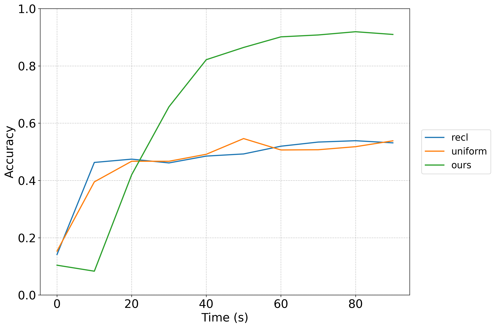
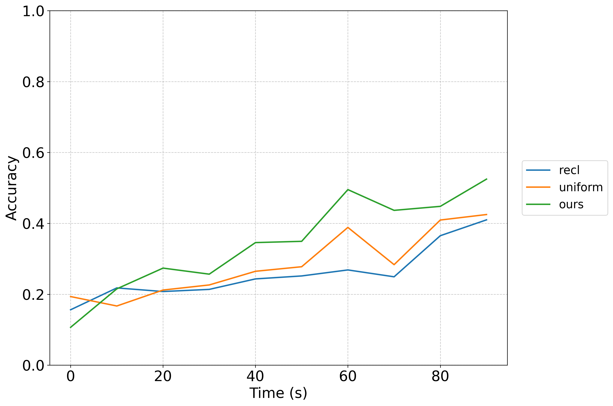
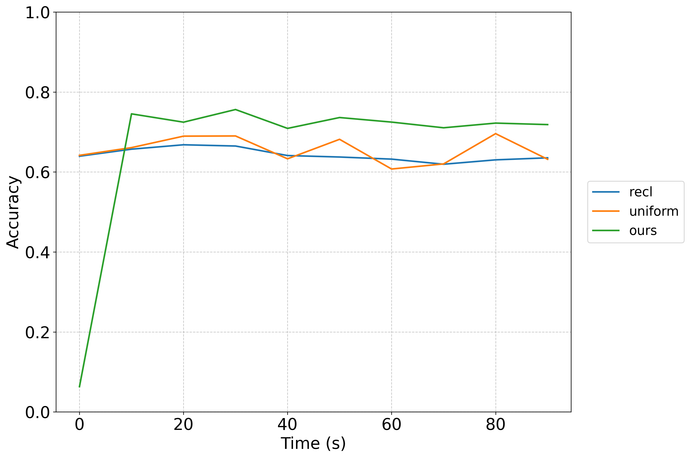
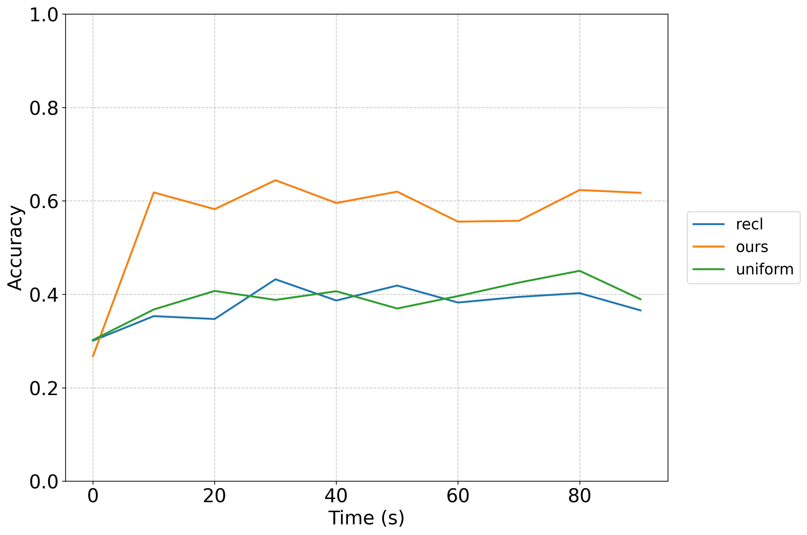

# Example Running Outputs

## 3.2 Integrating Different Models

### 3.2.2 Online integration

- **Image classification: ViT**

|     |                              Results                              |
|:---:|:-----------------------------------------------------------------:|
| **Working example** |  |

- **Object detection: YOLOS**

|     |                                     Results                                      |
|:---:|:--------------------------------------------------------------------------------:|
| **Working example** |  |

- **Semantic segmentation: DeepLab v3**

|     |                                       Results                                        |
|:---:|:------------------------------------------------------------------------------------:|
| **Working example** |  |

- **Action recognition: TSN**

|     |                                    Results                                     |
|:---:|:------------------------------------------------------------------------------:|
| **Working example** |  |

- **Text classification: RoBERTa**

|     |                              Results                              |
|:---:|:-----------------------------------------------------------------:|
| **Working example** |  |

- **Visual question answering: ViLT**

|     |                              Results                              |
|:---:|:-----------------------------------------------------------------:|
| **Working example** |  |
