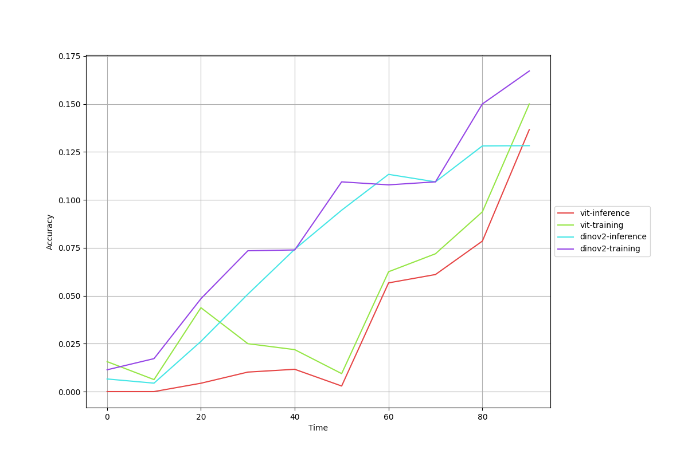
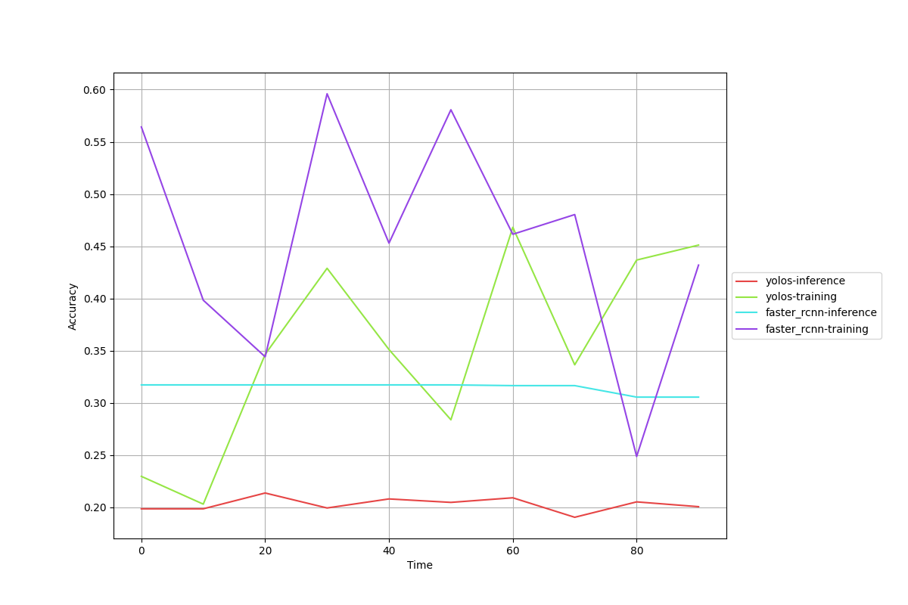
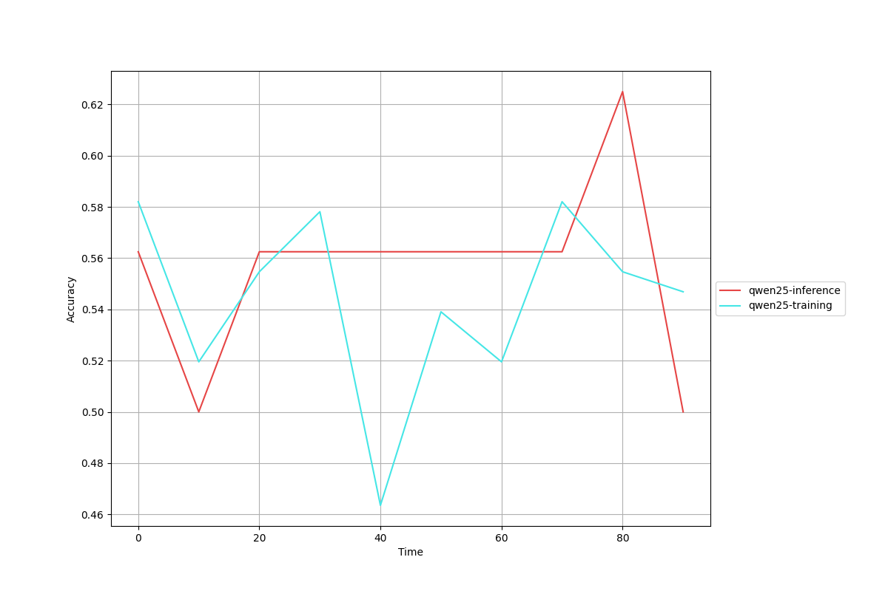
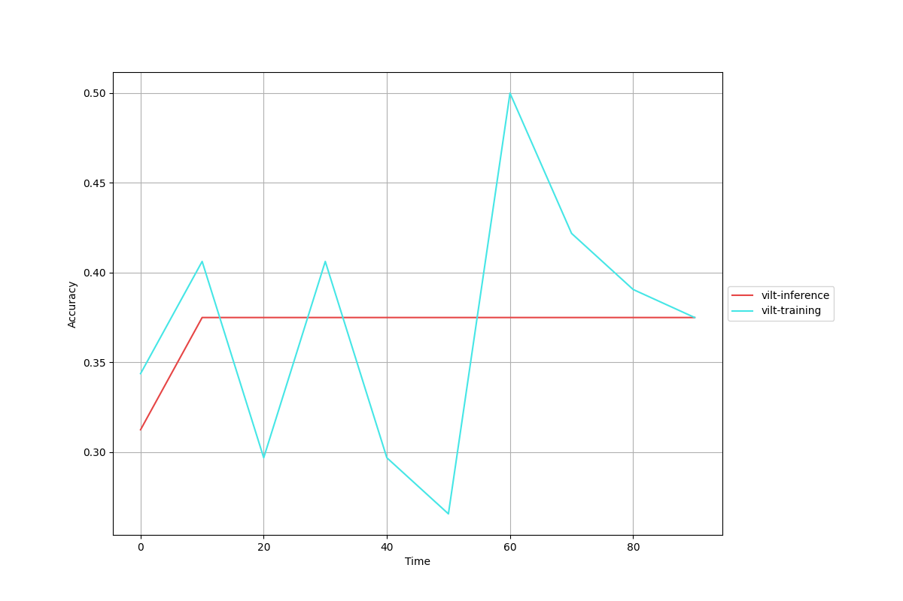

# Example Running Outputs

## 3.3 Integrating Different Edge Schedulers

### 3.3.1 Integrating Inference-oriented Schedulers

**Scheduler**: [PipeSD (ICML'26)](https://arxiv.org/abs/2605.13319)

- **Image classification**

|     |                              Results                              |
|:---:|:-----------------------------------------------------------------:|
| **Working example** |  |

- **Object detection**

|     |                              Results                              |
|:---:|:-----------------------------------------------------------------:|
| **Working example** |  |

- **Text classification**

|     |                              Results                              |
|:---:|:-----------------------------------------------------------------:|
| **Working example** |  |

- **Visual question answering**

|     |                              Results                              |
|:---:|:-----------------------------------------------------------------:|
| **Working example** |  |
